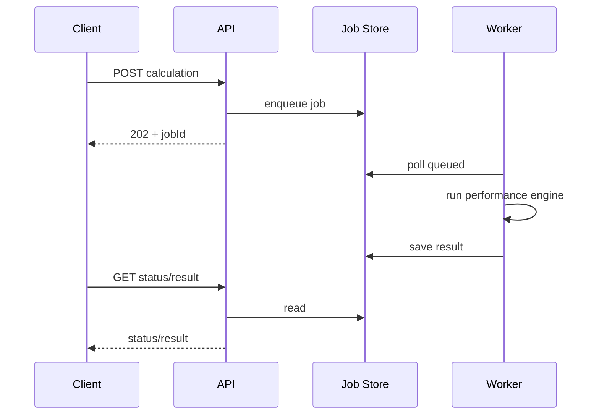

# API Overview

- `GET /api/v1/portfolios`
- `GET /api/v1/portfolios/{id}`
- `GET /api/v1/portfolios/{id}/holdings`
- `GET /api/v1/instruments`
- `POST /api/v1/performance-calculations`
- `GET /api/v1/performance-calculations/{jobId}`
- `GET /api/v1/performance-calculations/{jobId}/result`
- `GET /health`

