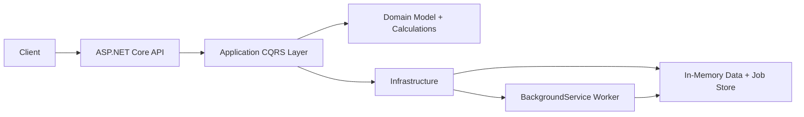

# Architecture

```mermaid
flowchart LR
Client-->Api[ASP.NET Core API]
Api-->App[Application CQRS Layer]
App-->Domain[Domain Model + Calculations]
App-->Infra[Infrastructure]
Infra-->Store[In-Memory Data + Job Store]
Infra-->Worker[BackgroundService Worker]
Worker-->Store
```

The platform uses Clean Architecture boundaries and CQRS handlers for all write/read use-cases.
